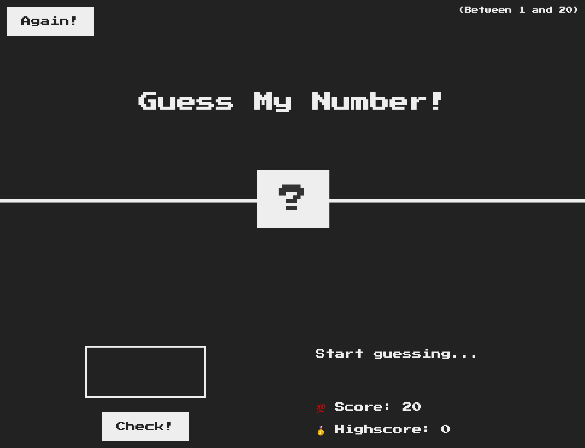
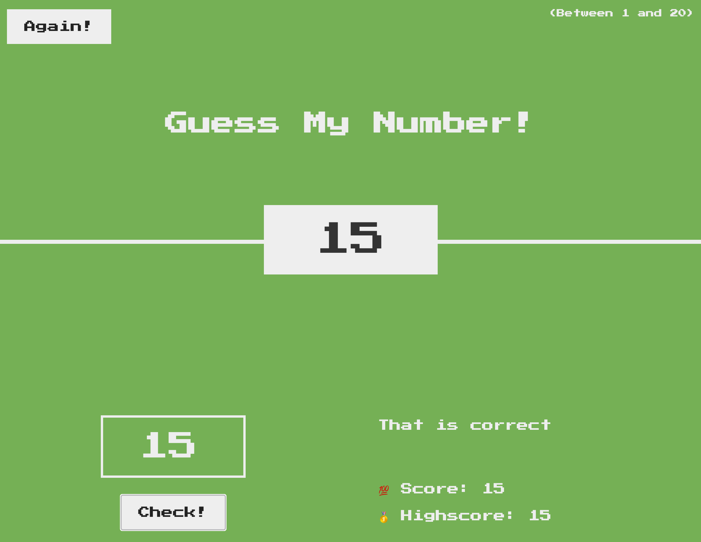
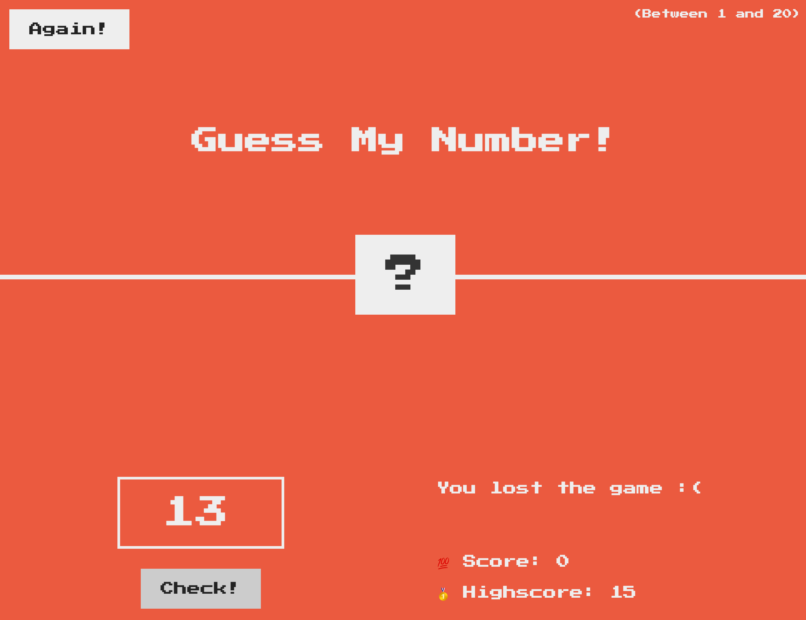

# Number-Guessing-JS
This is a fun project I followed and slightly tweaked from an online tutorial created by Jonas Schmedtmann. This project is great because it shows us how to use basic DOM manipulation. It is also a great project because it's simple and enables you to learn things like code refactoring and the JavaScript strict mode. 

## Basic Game Elements
The HTML has been provided in `index.html` and the css has been provided in `style.css`. Both files were provided directly by Jonas and do not constitute original work of mine. The JavaScript file `script.js`, on the other hand, is original code loosely based on the tutorial. By default, the user opens `index.html` and sees the following screen:

As you can see, there is an 'AGAIN' button which resets the game, a GUESS button which submits a guess, an empty text field for the user to input a number, a HIGHSCORE message, as well as a SCORE counter that diminishes by one every time the guess is incorrect. Clues are also given to let the user know if their guess is too high or too low. If the guess is correct, the user wins and the following is displayed: 

This requires DOM manipulation not only on the JavaScript of the project, but also on the CSS. We change the background color and the width of the number text. Conversely, the same is done if one loses the game: 

